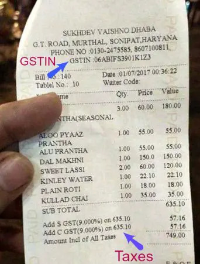

+++
date = '2024-03-19T10:06:43+05:30'
draft = false 
tags = ["Gemma3","multimodal","reasoning"]
categories = ["HowTo"]

image = "https://picsum.photos/id/121/400/100"
title = "Putting Gemma3 to the Test: Visual QA with a Restaurant Bill"
author =  "Murthy Udupa"
+++

Recently, I decided to explore the capabilities of the newly released Gemma3 model by subjecting it to a Visual Question Answering (VQA) challenge. My goal was to see how well it could handle a practical task: analysing a scanned image of a restaurant bill, extracting key details into a structured JSON format, and estimating the number of people who dined based on the order. Here’s how it went.

## The Test Setup

For this experiment, I chose a scanned image of a restaurant bill saved as `bill.jpg` in my `~/Downloads/` folder. The task was twofold: extract the text from the image accurately and use the extracted data to infer how many people likely ate at the table. To perform the inference, I ran the Gemma3 12B model locally using `ollama`, a handy tool for deploying and interacting with large language models.

The initial command I used was:

```
ollama run gemma3:12b "Extract the text in the image and output it in markdown format. Ensure the output is a JSON object. How many people do you think ate?" ~/Downloads/bill.jpg
```

However, I refined it for clarity and specificity to:

```
ollama run gemma3:12b "Extract the text in the image. Estimate the number of people dining and the reasoning behind it. Ensure the result is output as a json object" ~/Downloads/bill.jpg
```



This command instructed Gemma3 to process the image, extract the text, structure it as JSON, and provide an estimate of diners along with its reasoning.

## The Result

After running the command, Gemma3 processed the image and returned the following output:

```json
{
  "restaurant_name": "SUKHDEV VAISHNO DHABA",
  "location": "G.T. ROAD, MURTHAL, SONIPAT, HARYANA",
  "GSTIN": "06ABFS3901K1Z3",
  "bill_number": 140,
  "date": "06/07/2017",
  "time": "00:36:22",
  "table_number": 10,
  "waiter_code": "N/A",
  "items": [
    {"name": "Seasonal", "quantity": 3.00, "price": 60.00, "value": 180.00},
    {"name": "Aloo Pyazz", "quantity": 1.00, "price": 55.00, "value": 55.00},
    {"name": "Prantha", "quantity": 1.00, "price": 55.00, "value": 55.00},
    {"name": "Dal Makhni", "quantity": 1.00, "price": 150.00, "value": 150.00},
    {"name": "Sweet Lassi", "quantity": 2.00, "price": 60.00, "value": 120.00},
    {"name": "Kinley Water", "quantity": 1.00, "price": 22.10, "value": 22.10},
    {"name": "Plain Roti", "quantity": 1.00, "price": 18.00, "value": 18.00},
    {"name": "Kullad Chai", "quantity": 1.00, "price": 35.00, "value": 35.00}
  ],
  "subtotal": 635.10,
  "cgst": 57.16,
  "sgst": 57.16,
  "total": 749.00,
  "estimated_number_of_people": 3,
  "reasoning": "The bill includes 3 servings of 'Seasonal' and a variety of items suitable for a small group. While it's possible for one person to order this much, it's more likely that a group of 3 people shared the meal. The variety of items suggests a shared dining experience rather than individual orders."
}
```

## Breaking It Down

The output is impressively detailed. Gemma3 successfully extracted key metadata like the restaurant name, location, bill number, date, and time. It also itemised the order, capturing the name, quantity, price per unit, and total value for each item. The subtotal, taxes (CGST and SGST), and grand total—were spot on.

But the real test of intelligence came with the estimation of diners. Gemma3 didn’t just throw out a number; it provided a reasoned explanation. It noted the three servings of "Seasonal" (likely a dish like seasonal vegetables) and the variety of items—parathas, dal, lassi, chai, and more. It reasoned that while a single person could order this much, the diversity and quantities suggest a small group, settling on an estimate of three people. This shows a blend of **data extraction** and **contextual reasoning**, which is pretty remarkable for an AI model.

